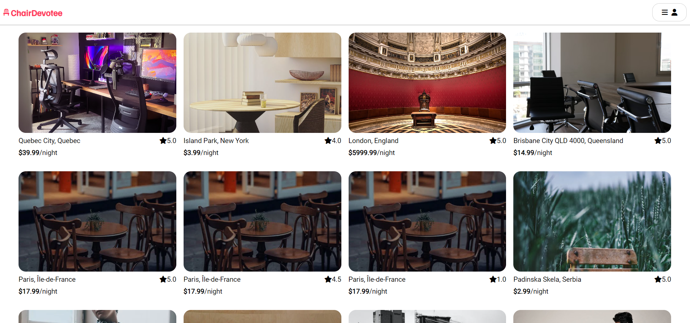
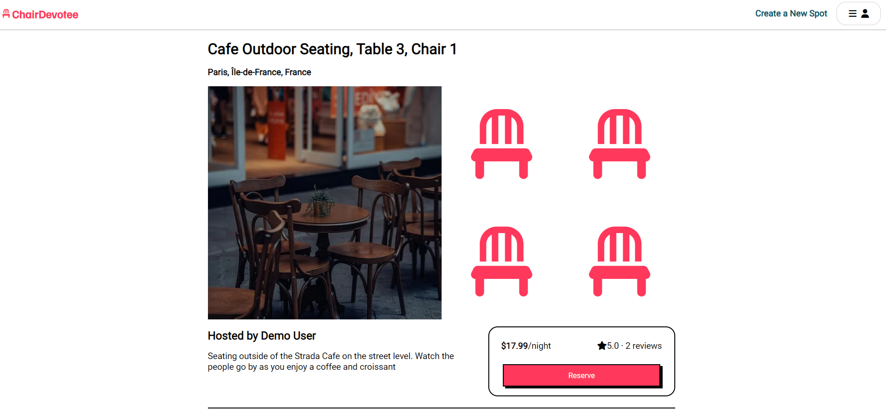
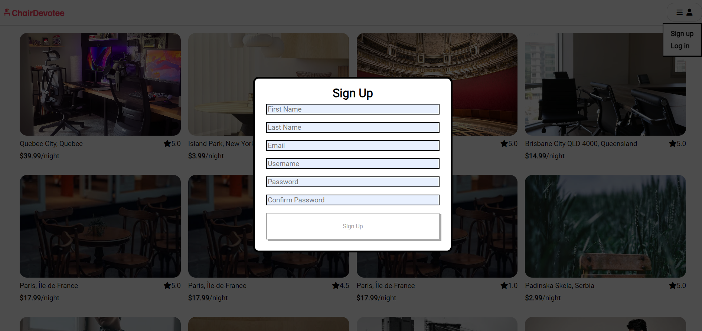
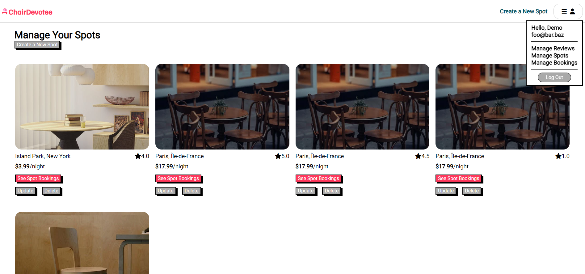

# ChairDevotee

## Technologies


## Browse the live site on Render!

<a target='_blank' href='https://chairdevotee.onrender.com'></a>



## What is ChairDevotee?

ChairDevotee is a website dedicated to finding and documenting chairs in the wild, letting users review and rent out places to sit!

## No really, why did you do this?

ChairDevotee is a clone of AirBnB that replicates all of your favorite functionality,* except it was built by _me_--immediately making my mom prefer it more!

> "What's Airbnb? What am I looking at, Isaac?" -- Momma Gamus

ChairDevotee is a solo project built using the following:

* React.js
* Redux
* Express.js
* Sequelize

*some of your favorite functionality -- it's actually slightly more intense to implement than I thought it would be

## What can I do on ChairDevotee?


On ChairDevotee, you can peruse a variety of listings (spots), see what people think of them--by perusing average ratings and user-posted reviews--and make bookings. You can think of the functionality showcased on ChairDevotee in terms of technical features.

1. User accounts
2. Spots (full CRUD feature)
3. Reviews (full CRUD feature)
4. Bookings (full CRUD feature)

### 1. User accounts



ChairDevotee uses JWT tokens as cookies and verifies user passwords saved in hashes, allowing for users to register and securely sign into accounts on ChairDevotee. Users without an account can see spot listings, but users with accounts gain access to more features on the site, gaining the ability to create, delete, and edit spots and reviews.

### 2. Spots



As representations of chairs in the world, ChairDevotee thinks of each chair as a 'Spot' and provides users with full CRUD interactivity with Spots, allowing them to

* Create spots (logged-in users only)
* Read/see spots
* Update their spots (logged-in users on their own spots only)
* Delete their spots (logged-in users on their own spots only)

Logged-in users can manage spots they own from a respective spot's detail page or from a central "Manage Spots" page.

### 3. Reviews

ChairDevotee provides users with the ability to

* Create reviews of other user's spots (logged-in users only)
* Read reviews on user spots
* Update their own reviews (logged-in users on their own spots only)
* Delete their own reviews (logged-in users on their own spots only)

Logged-in users can manage reviews they authored from a respective spot's detail page or from a central "Manage Reviews" page.

### 4. Bookings

Logged-in users can

* Create bookings for spots owned by other users (logged-in users only)
* See bookings they have made from their "Manage Bookings" page (logged-in users only)
* Update bookings they have made from their "Manage Bookings" page (logged-in users only)
* Delete bookings they have made from their "Manage Bookings" page (logged-in users only)

## What can I do on ChairDevotee if I am a computer?

Computers will want to see the [API routes](./backend/README.md)!

## What are your future plans with this repo?

The roadmap includes

* **Spots search**
* Integrate **Google Maps**

and more!

## How to deploy locally

To get started

1. Clone the repo

```bash
git clone git@github.com:igamus/API-Project-AirBnB.git <local-repo-name>
```
2. Copy the `.envexample` file and save it as `.env`.
    * Fill out `JWT_SECRET=` with a secure code.
    * Fill out `JWT_EXPIRES_IN=` with a time (in seconds) representing how long you'd like your token to last.
3. Navigate into the `backend/` directory, and install dependencies, run the migrations, and seed the demo database
```bash
npm i && npx dotenv sequelize db:migrate && npx dotenv sequelize db:seed:all
```
4. You should be set to run the server! In the `backend/` directory, run the server using.
```bash
npm start
```
5. Open a new terminal, navigate into the `frontend/` directory, and run the same command. You should be set to peruse the site on your local host.


## Contact information
You can reach the developer (myself), Isaac Gamus, by
email at isaacgamusdev@gmail.com or on [LinkedIn](https://linkedin.com/in/isaac-gamus).
